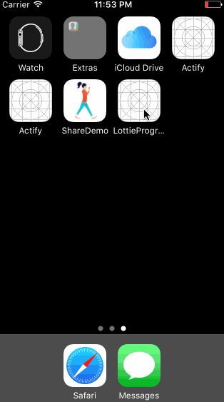

# LottieProgressAnimation

If you like Lottie animation by AirBnB, you know that `animationProgress` property
is a great functionality, that gives you the opportunity to connect your
beautiful animations with user interaction, like a swipe.

But if you want to change the animation progress based on a timer?

Based on the project **CountingLabel** by Sudeep Agarwal and the idea to
increment with an animation timer based
a label, I decided to use the same logic with `LOTAnimationView`.



## Lottie issue
The Lottie update 1.5.2 introduced an issue with `animationProgress` property,
so this project, for now, uses version **1.5.1**.

### How it works

1. First you need to create the `LOTAnimationView` and add it to another view. I
  suggest to create with Storyboard a *container view* with autolayout and add
  the `LOTAnimationView` to it, because right now it's not possible to create a
  `LOTAnimationView` directly to the Storyboard.
  I created two simply functions to don't repeat, every time, the same codes. You just pass the JSON file name, the container view reference and the `UIViewContentMode`:

  ```swift
static func addAnimation(withName name: String, to view: UIView) -> LOTAnimationView? {
        guard let animationView = LOTAnimationView(name: name) else { return nil }

        animationView.frame = CGRect(x: 0,
                                     y: 0,
                                     width: view.frame.size.width,
                                     height: view.frame.size.height)

        animationView.contentMode = .scaleAspectFill
        animationView.loopAnimation = false

        view.addSubview(animationView)

        return animationView
    }
```
```swift
    static func addAnimation(withName name: String,
                             to view: UIView,
                             withContentMode contentMode: UIViewContentMode) -> LOTAnimationView? {
        guard let animationView = LOTAnimationView(name: name) else { return nil }

        animationView.frame = CGRect(x: 0,
                                     y: 0,
                                     width: view.frame.size.width,
                                     height: view.frame.size.height)

        animationView.contentMode = contentMode
        animationView.loopAnimation = false

        view.addSubview(animationView)

        return animationView
    }
```

2. Now you can use `ProgressAnimation` with your `LOTAnimationView` object.
```swift
    override func viewWillAppear(_ animated: Bool) {
        super.viewWillAppear(animated)

        setupLottieView()

        let progress = ProgressAnimation()

        progress.start(from: 0.0,
                       to: Float(5000.0/10000.0),
                       duration: 1.5,
                       animation: .easeOut) { (progress) in
                        self.update(with: progress)
        }

    }

    private func update(with value: Float) {
        animationView?.animationProgress = CGFloat(value)
    }
```
`ProgressAnimation` supports 4 animation types:
```swift
public enum AnimationType {
    case linear
    case easeIn
    case easeOut
    case easeInOut
}
```
You can customize how this types work with this function create by Sudeep Agarwal:
```swift
    private func update(counter t: Float) -> Float {
        switch animationType {
        case .linear:
            return t
        case .easeIn:
            return powf(t, kCounterRate)
        case .easeOut:
            return 1.0 - powf((1.0 - t), kCounterRate)
        case .easeInOut:
            var t = t
            var sign = 1.0;
            let r = Int(kCounterRate)
            if (r % 2 == 0) {
                sign = -1.0
            }
            t *= 2;
            if (t < 1) {
                return 0.5 * powf(t, kCounterRate)
            } else {
                return Float(sign * 0.5) * (powf(t-2, kCounterRate) + Float(sign * 2))
            }
        }
    }
```

### Examples

In `FirstViewController.swift` and `SecondViewController.swift` two simple
examples about the use of `ProgressAnimation`.
